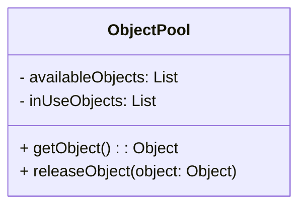
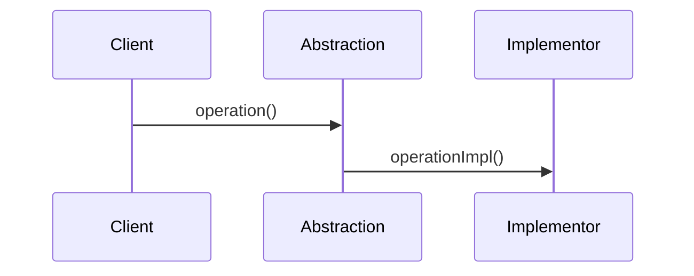
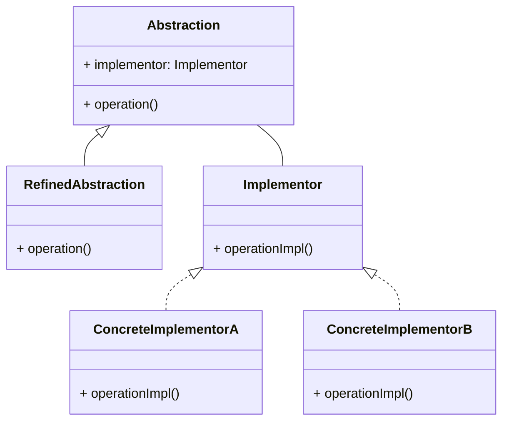
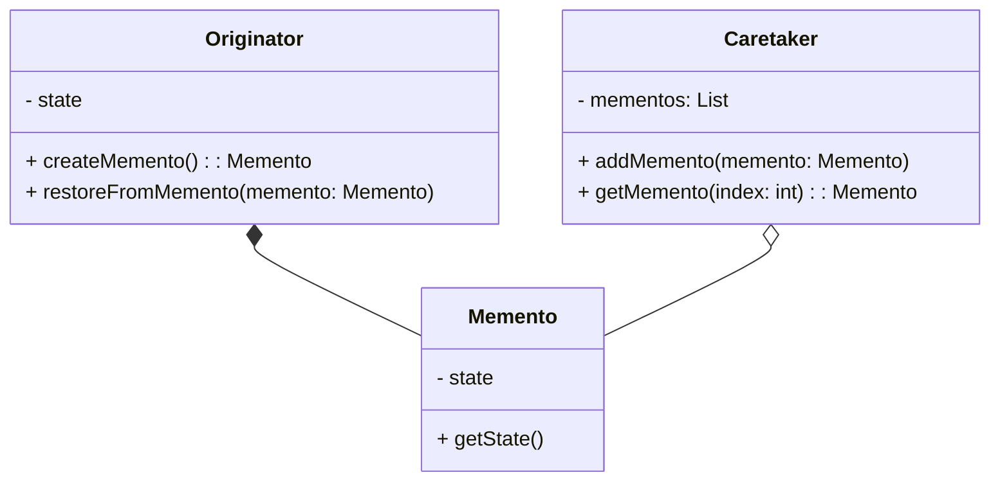
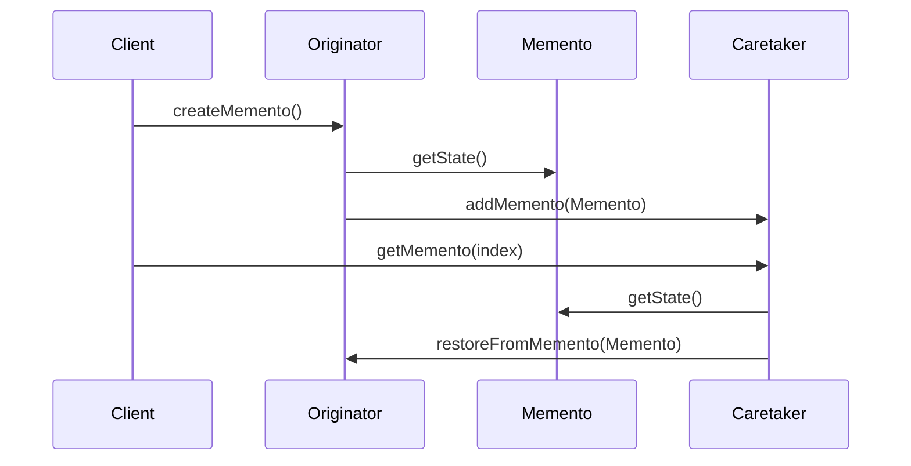
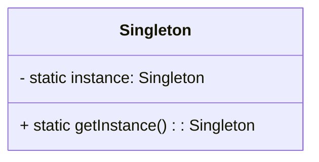
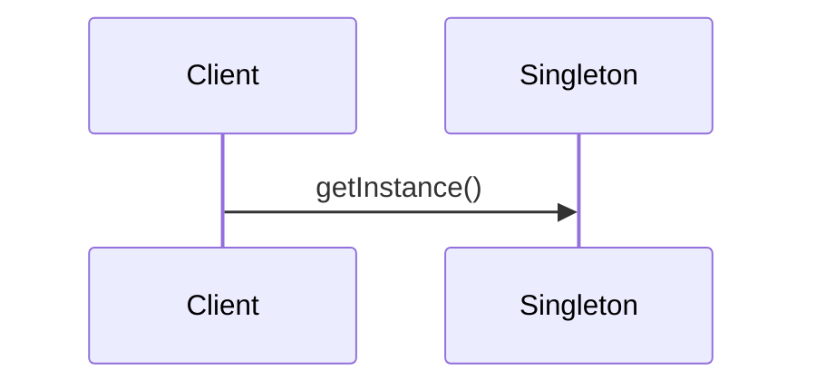

# Шаблони проектування
Документ містить описи та графічне подання шаблонів проектування в програмній інженерії. Шаблони проектування - це загальні рішення для типових проблем, які можуть виникнути під час розробки програмного забезпечення. Кожен з шаблонів надає вказівки щодо організації коду та структури проекту, що допомагає покращити його зрозумілість, підтримку та розширюваність.

Зміст:
- [Пул об'єктів](#object-pool-пул-обєктів)
- [Bridge (Міст)](#bridge-міст)
- [Memento (Моменто)](#memento-моменто)
- [Double Checked Locking (Подвійна перевірка блокування)](#double-checked-locking-подвійна-перевірка-блокування)
- [Джерела](#джерела)

## Object Pool (Пул об'єктів)
### Опис:
Шаблон Object Pool використовується для підтримки пула об'єктів, який забезпечує готовість до використання та перевикористання об'єктів замість їх створення і знищення.

### Графічне подання:
#### Статична модель (діаграма класів):

#### Динамічна модель (діаграма взаємодії):

## Bridge (Міст)
### Опис:
Шаблон Bridge використовується для розділення абстракції від її реалізації, так що обидва можуть змінюватись незалежно.

### Графічне подання:
#### Статична модель (діаграма класів):

#### Динамічна модель (діаграма взаємодії):

## Memento (Моменто)
### Опис:
Шаблон Memento використовується для зберігання стану об'єкту таким чином, щоб в майбутньому можна було відновити цей стан без розкриття внутрішньої структури об'єкта.

### Графічне подання:
#### Статична модель (діаграма класів):

#### Динамічна модель (діаграма взаємодії):

## Double Checked Locking (Подвійна перевірка блокування)
### Опис:
Шаблон Double Checked Locking використовується для оптимізації доступу до глобальних ресурсів шляхом перевірки блокування перед введенням в критичну секцію.

### Графічне подання:
#### Статична модель (діаграма класів):

#### Динамічна модель (діаграма взаємодії):

## Джерела
1. TutorialsPoint[Електронний ресурс] - https://www.tutorialspoint.com/design_pattern/index.htm
2. Gang of Four Design Patterns [Електронний ресурс] -https://github.com/topics/gang-of-four-design-patterns?l=java
