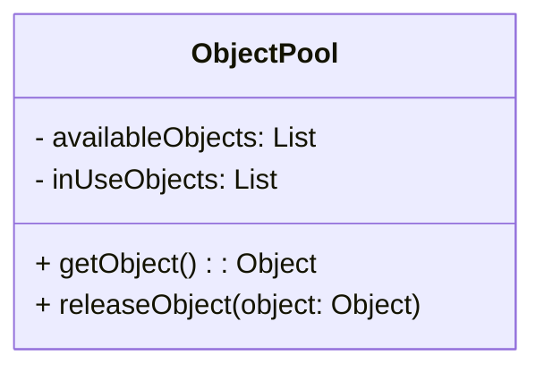

# Шаблони проектування

## Object Pool (Пул об'єктів)

### Опис:
Шаблон Object Pool використовується для підтримки пула об'єктів, який забезпечує готовість до використання та перевикористання об'єктів замість їх створення і знищення.

### Графічне подання:

#### Статична модель (діаграма класів):


Динамічна модель (діаграма взаємодії):
```
sequenceDiagram
    participant Client
    participant Abstraction
    participant Implementor
    Client->>Abstraction: operation()
    Abstraction->>Implementor: operationImpl()
```


